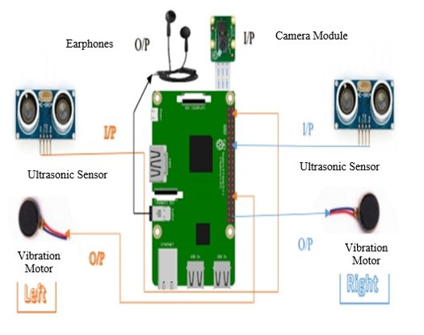
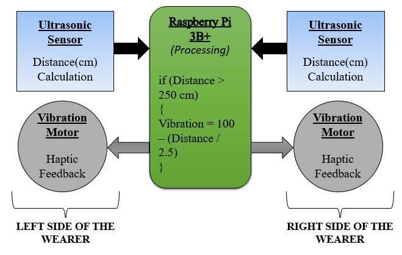
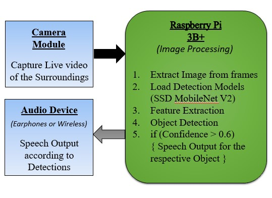

# Navigation-and-Object-Identification-Aid-for-the-Visually-Challenged  

This project develops an affordable, lightweight electronic navigation system designed to help visually impaired people travel independently. The device is shaped like a pair of eyeglasses and incorporates **ultrasonic sensors** and **vibration motors** to provide spatial awareness of obstacles.

---

## Hardware Setup

  
  

---

## Key Features
1. **Obstacle Detection**  
   - Two ultrasonic sensors detect objects up to **400 cm ahead**.  
   - Feedback is delivered via two calibrated vibration motors, allowing users to perceive the **distance** and **location** of obstacles by changes in vibration intensity and position.  

2. **Object Identification**  
   - A camera module continuously captures live video.  
   - A **TensorFlow-based model** processes this video in real time to identify objects ahead.  
   - Identified objects are announced to the user through **earphones**, aiding object search and recognition.  

  
  

---

## Technology Stack
- **Raspberry Pi 3B+** → Embedded processing  
- **HC-SR04 Ultrasonic Sensors** → Distance measurement  
- **Precision Vibration Motors** → Tactile feedback  
- **TensorFlow** → Machine learning-based image recognition  
- **Compact Camera Module** → Video capture  

---

## Impact
The device combines **sensor-based obstacle detection** with **AI-driven object recognition** to enhance mobility and independence for the visually impaired.  
It offers an **intuitive, wearable interface** that supports **safe navigation** in real-world environments.

---

 *Developed with the goal of making navigation more accessible for the visually challenged.*
